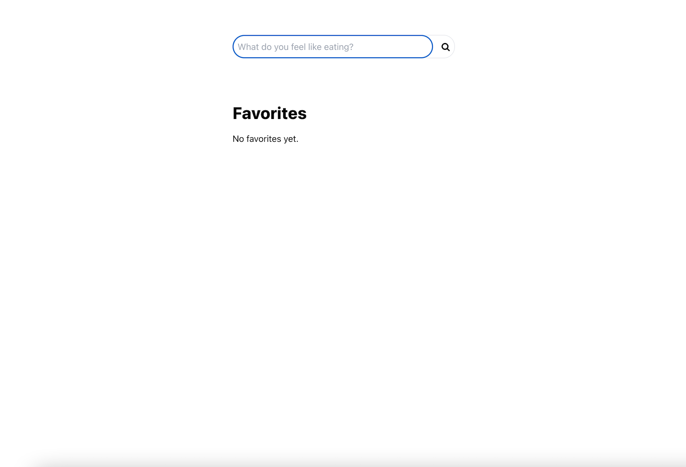

# Recipe Finder Web App
Built a React Web Application that fetches recipes from Gemini API, based on user input, and saves them in a list of favorites.

Home page:

Searching for recipes: (e.g. 'avocado')

Suggested Recipes:

Alternative Recipes (Selected 'I don't like these button')
- also selecting recipes as favorites:

